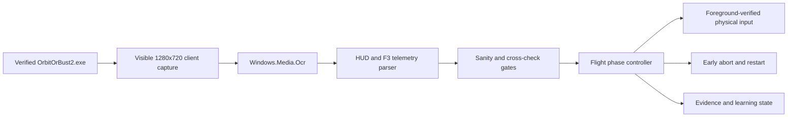

# Architecture

OB2 Tester is a deterministic Windows application controller around one build-specific adapter. It deliberately observes the rendered game instead of loading the game's simulation assemblies.

## Trust boundary

Before controlling anything, the script resolves the supplied executable, checks its SHA-256, locates exactly one visible process with that path, and records its window handle and process ID. Every keyboard or mouse action brings that handle forward and then revalidates the foreground handle, process ID, and executable path. A failed check stops the action.

The controller captures only the game client with `GetClientRect`, `ClientToScreen`, and `CopyFromScreen`. It does not intentionally capture the title bar or surrounding desktop. Because this is screen capture, the game must remain visible, unminimized, and unobscured.

## Observation pipeline

One persistent local `Windows.Media.Ocr.OcrEngine` reads the full client at roughly 5-10 observations per second. A separately thresholded crop reads the low-contrast F3 position, velocity, and angle overlay. The parser also extracts high-contrast HUD values:

- mission time, altitude, vertical speed, and total speed
- apoapsis, periapsis, and time to apoapsis
- stage fuel, total fuel, mass, thrust, and dynamic pressure
- stage prompts, scene identity, warp state, and the rendered ORBIT message

F3 vectors are accepted only when their derived altitude, speed, and radial velocity agree with independent HUD readings. Implausible angle jumps and OCR values are rejected.

## Guidance and orbital state

The build profile uses Gaia radius 600,000 m, gravitational parameter 3.5316e12 m^3/s^2, and a 70,000 m atmosphere. From position and velocity, the controller derives specific orbital energy, eccentricity, semi-major axis, apoapsis, periapsis, radial velocity, prograde angle, and time to apoapsis.

The verified SRB pitch program starts its turn at 350 m, reaches horizontal by 30 km, targets an initial 82 km apoapsis, and limits atmospheric angle of attack to 0.28 rad. The controller then coasts, estimates half of the circularization burn, burns prograde, and cuts throttle after a validated stable-orbit gate.

## State machine

The main phases are `pitch`, `coast`, `circularize`, and `orbit`. Staging is driven by rendered stage instructions plus fuel and thrust state. The controller does not press the recovery parachute during ascent.

A success requires two observations from distinct mission times where:

- rendered periapsis is above the configured 71 km margin;
- apoapsis is greater than or equal to periapsis and remains within sane bounds; and
- the game renders its ORBIT confirmation.

Early aborts cover stale telemetry, heading divergence, escape trajectory, excessive apoapsis, suborbital descent, empty fuel, noncompetitive coast, exceeding the saved best time, and the hard mission-time limit.

## Learning and evidence

Immutable build benchmarks live under `benchmarks/<sha256>/`. Mutable learning state lives outside the repo under `%LOCALAPPDATA%\OB2Tester\state\<sha256>\learning-state.json` by default. State is only reused when its executable hash matches the active build. Unknown-build operation requires the explicit `-AllowUnknownBuild` switch.

Each live run writes a UTC-named directory under `runs/` containing relative-path transcripts, result JSON, and selected screenshots. Generated runs are ignored by Git. The prose review is intentionally manual and reviewed; it is not generated by the controller.

## Build-specific adapter surface

The reusable engine concepts are capture, OCR, telemetry validation, target-safe input, evidence, restart rules, and learning. The following remain Orbit/build specific:

- executable SHA and process/window expectations
- 1280x720 UI geometry, client-relative preset coordinates, and F3 crop
- craft names, part/stage counts, and key bindings
- Gaia constants and orbit-success rules
- staging semantics and ascent/circularization policy

A future generic visible-game tester should move those values into a SHA-keyed adapter and keep this file as the OB2 adapter reference.
